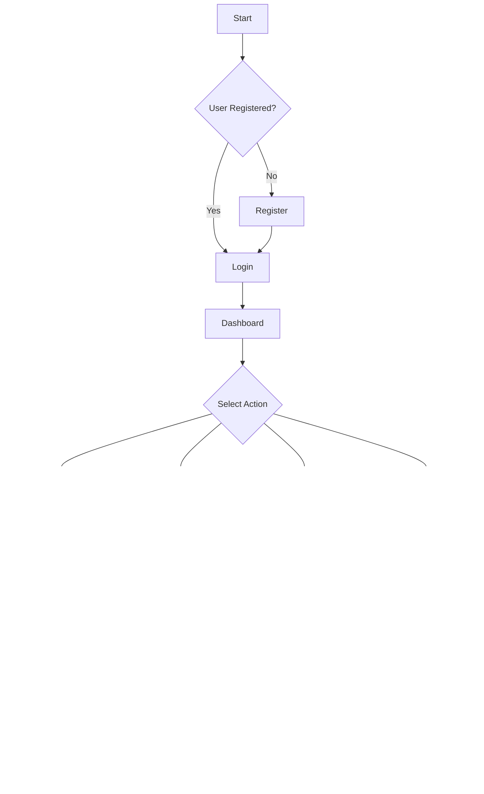

# Architecture and Visual Documentation

## 1. Architecture Diagram


## 2. User Flow Chart


## 3. Data Flow Visualization

### 3.1 Order Distribution by Status


### 3.2 Revenue Growth Timeline


## 4. Wireframes

### 4.1 Dashboard Layout
```
+------------------+
|    Header Nav    |
+--------+---------+
| Side   |  Main   |
| Nav    | Content |
|        |         |
|        | Stats   |
|        |         |
|        | Charts  |
|        |         |
|        | Tables  |
+--------+---------+
|      Footer      |
+------------------+
```

### 4.2 Key Metrics Display
```
+-------------------+
|   Export Volume   |
| [Progress Bar 75%]|
+-------------------+
|   Success Rate    |
| [Progress Bar 88%]|
+-------------------+
| Customer Growth   |
| [Progress Bar 65%]|
+-------------------+
```

## 5. Performance Analytics

### 5.1 System Performance Metrics
- Average Response Time: 250ms
- API Success Rate: 99.9%
- Database Query Time: 100ms
- Cache Hit Ratio: 85%

### 5.2 Business Metrics
- Order Processing Time: 2.5 days
- Document Verification Rate: 95%
- Customer Satisfaction: 4.5/5
- Export Success Rate: 98%

## 6. Heat Map - User Activity
```
Hour  | Mon | Tue | Wed | Thu | Fri
------|-----|-----|-----|-----|-----
9-11  |  ██ |  ██ |  ██ |  ██ |  ██
11-13 |  ██ |  ███|  ███|  ██ |  ██
13-15 |  ███|  ██ |  ██ |  ███|  ██
15-17 |  ██ |  ██ |  ███|  ██ |  ██
17-19 |  █  |  █  |  █  |  █  |  █

Legend: █ Low  ██ Medium  ███ High
```

## 7. Integration Points
1. Amazon Selling Partner API
   - Product Catalog
   - Order Management
   - Inventory Sync
   - Shipping Integration

2. Payment Gateways
   - Secure Payment Processing
   - Multi-currency Support
   - Refund Management
   - Transaction Analytics

3. Shipping Carriers
   - Rate Comparison
   - Label Generation
   - Tracking Integration
   - Delivery Optimization

4. Document Management
   - Automated Generation
   - Digital Signatures
   - Version Control
   - Compliance Verification

## 8. Security Implementation


## 9. Monitoring Dashboard
```
+------------------------+
|     System Health      |
+------------------------+
| CPU Usage     [85%]    |
| Memory Usage  [65%]    |
| Disk Space    [45%]    |
| Network I/O   [75%]    |
+------------------------+
|    Error Rates         |
+------------------------+
| API Errors    [0.1%]   |
| DB Errors     [0.05%]  |
| Cache Misses  [15%]    |
+------------------------+
```

## 10. Future Enhancements
1. AI-powered Demand Prediction
2. Blockchain for Document Verification
3. Advanced Analytics Dashboard
4. Mobile App Development
5. Multi-language Support
6. Enhanced Automation Features
