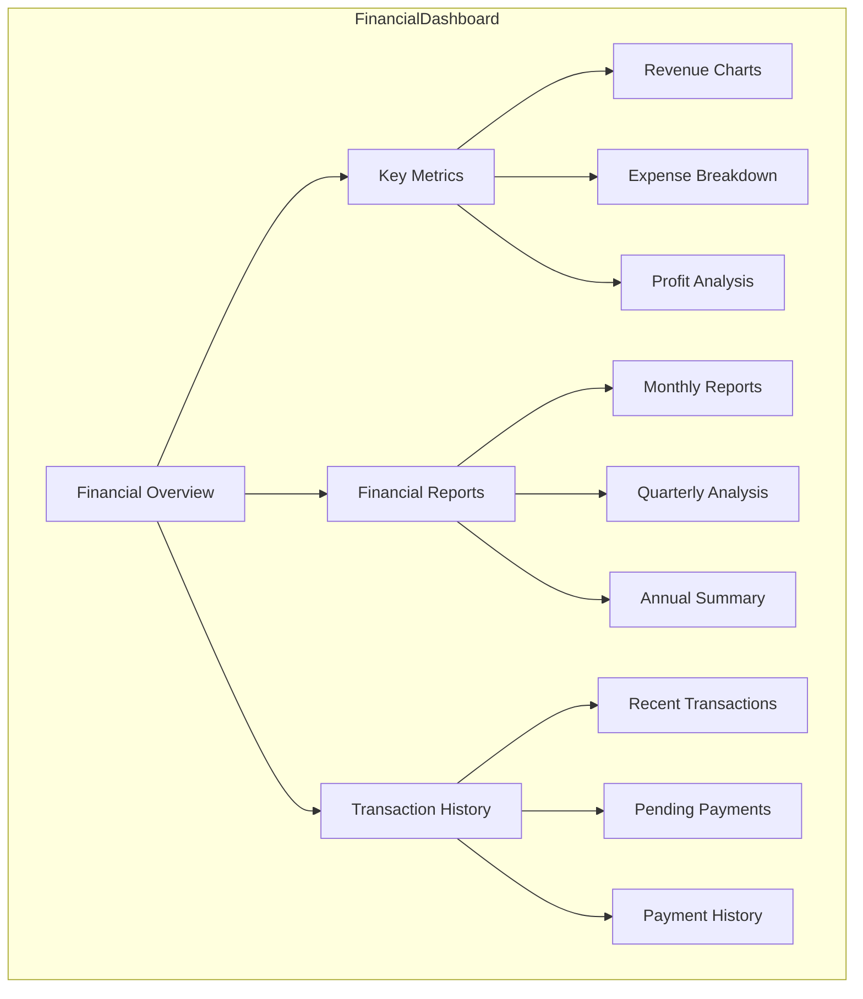

# Amazon SMB Export Platform Wireframes

This document contains wireframe diagrams for the key interfaces of our export management platform.

## Dashboard Layout

## Navigation Flow

## Order Management Interface

## Document Management System

## Financial Dashboard

## Shipment Tracking Interface

## Inventory Management

## Help Center Layout

## Mobile Responsive Design

## Chat and Communication Interface

These wireframes provide a visual representation of the platform's interface structure and user flow. Each diagram represents a key section of the application, showing the relationship between different components and the hierarchical organization of information.
